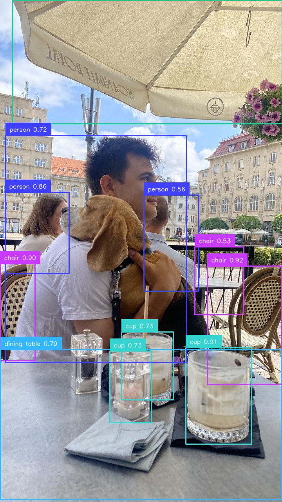

# scope-rf-detr-detection

Real-time object detection plugin for [Daydream Scope](https://github.com/daydreamlive/scope),
powered by Roboflow's [RF-DETR](https://github.com/roboflow/rf-detr). It runs RF-DETR on each
video frame and returns the frame annotated with bounding boxes for the 80 COCO classes.

## Demo

Live webcam → RF-DETR on an RTX 3080 → annotated stream back, in real time (~23 FPS):

https://github.com/user-attachments/assets/a809b20b-7f3a-4732-92f4-e6ca65354ed5

Example single-frame detection:



## Features

- Drop-in Scope pipeline node: **`rfdetr-detection`**
- RF-DETR detection variants: `nano`, `small`, `medium`, `base`, `large` (all Apache-2.0)
- Annotated bounding boxes with class labels and confidence (via [`supervision`](https://github.com/roboflow/supervision))
- Runs real-time on a consumer GPU; nano uses ~2 GB VRAM

## Compatibility

RF-DETR is pinned to **`rfdetr==1.5.0`** on purpose: it is the newest RF-DETR release that
requires `transformers<5`, which matches Scope's pinned `transformers 4.57.x`. `rfdetr>=1.6`
requires `transformers>=5.1`, which conflicts with Scope's diffusion stack.

## Installation

From a checkout of Scope, add the plugin as an editable dependency so it is locked and
discovered on startup:

```bash
uv add --editable ../scope-rf-detr-detection
```

Or install it into Scope's environment directly:

```bash
uv pip install -e ../scope-rf-detr-detection
```

On first use the chosen RF-DETR weights are downloaded automatically (nano ≈ 349 MB).

## Usage

Start Scope and select the **RF-DETR Detection** pipeline (`rfdetr-detection`). Point any
video source at it (webcam, video file, NDI, …) and the output stream shows annotated
detections.

### Configuration

| Parameter | Default | Description |
|---|---|---|
| `model_variant` | `nano` | RF-DETR size: `nano` / `small` / `medium` / `base` / `large` |
| `confidence_threshold` | `0.5` | Minimum detection confidence |
| `show_labels` | `true` | Draw class labels on boxes |
| `show_confidence` | `true` | Append confidence scores to labels |

## Local test

`manual_test.py` runs the pipeline on a sample image outside Scope and saves an annotated
frame — useful to verify the model loads on the GPU:

```bash
python manual_test.py
```

## License

Plugin code: Apache-2.0. RF-DETR (`nano`–`large`) and `supervision` are Apache-2.0.
